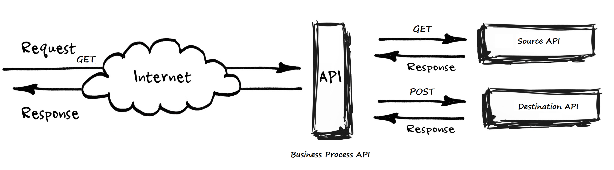

# Invitation API
Invitation API that process JSON file from a REST API and Post the consolidate data into another API

Using Open Feign for declarative REST client calls

Using Feign-Hystrix for implementing fallbacks



Business logic: Take a list of partners then grouping by country and select partners with availability for two days in a row and more attendees

## Test Invitation process
```
mvn spring-boot:run
```

Now that the app is running, visit http://localhost:8080/invitation/process in order to execute the Invitation REST API

```
# Expected JSON response body:
{"message":"Results match! Congratulations!"}
```